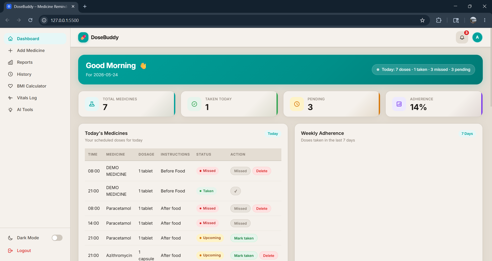
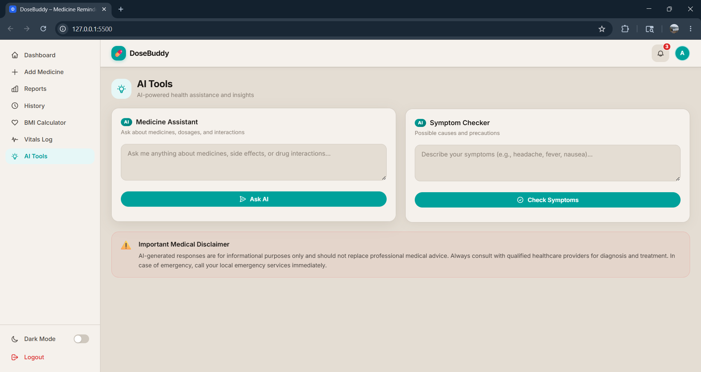
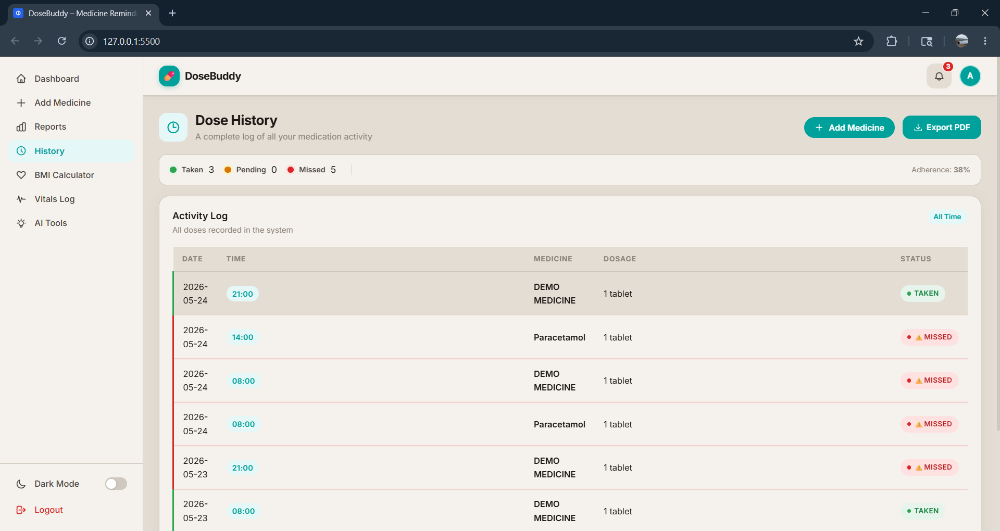
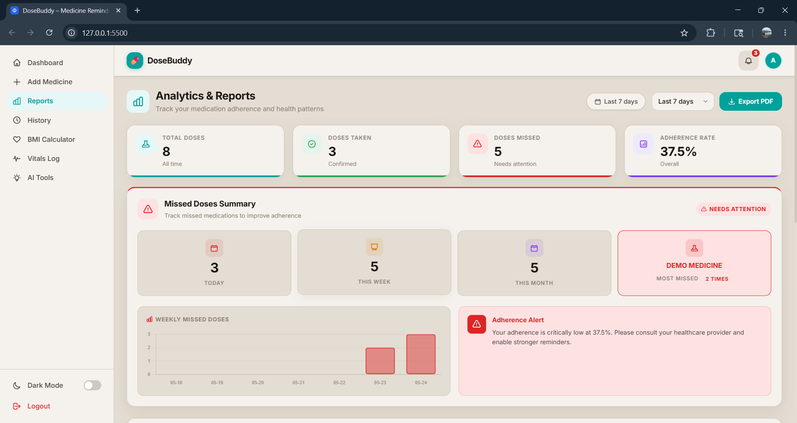

<div align="center">


<br/>

# 💊 DoseBuddy

### AI-Powered Medicine Reminder & Healthcare Assistant

<p>
  <a href="https://www.java.com/"></a>
  <a href="https://spring.io/projects/spring-boot"></a>
  <a href="https://www.mysql.com/"></a>
  <a href="https://developer.mozilla.org/en-US/docs/Web/JavaScript"></a>
</p>
<p>
  <a href="https://groq.com/"></a>
  <a href="https://ai.google.dev/"></a>
  <a href="LICENSE"></a>
</p>

<br/>

**DoseBuddy** is a production-style, full-stack healthcare web application that combines intelligent medicine reminders, AI-powered health assistance, and prescription scanning — all in one clean, responsive interface.

<br/>

[🚀 Features](#-features) &nbsp;•&nbsp; [🤖 AI Features](#-ai-features) &nbsp;•&nbsp; [🛠 Tech Stack](#-tech-stack) &nbsp;•&nbsp; [⚙️ Setup](#️-installation--setup) &nbsp;•&nbsp; [📸 Screenshots](#-screenshots) &nbsp;•&nbsp; [👨‍💻 Author](#-author)

<br/>

</div>

---

## 📖 About the Project

> *"Nearly 50% of patients with chronic conditions don't take their medications as prescribed — leading to preventable hospitalizations and worsening health outcomes."*

**DoseBuddy** was built to directly address this problem. It's a healthcare assistant that meets users where they are — helping them track medications, understand prescriptions, and get instant AI-powered health guidance without needing a doctor's appointment for every question.

### What makes DoseBuddy different?

| Challenge | DoseBuddy's Solution |
|---|---|
| Forgetting to take medicines | Smart scheduling + browser notifications |
| Not understanding prescriptions | Gemini Vision OCR auto-extracts medicine details |
| No access to quick health guidance | Groq LLaMA 3.3 AI assistant available 24/7 |
| Difficulty tracking health trends | BMI, vitals, adherence streaks & visual reports |
| Complex prescription documents | Drag-and-drop OCR scanner for images & PDFs |

Built as a **portfolio-grade, production-style full-stack project**, DoseBuddy demonstrates end-to-end software engineering — from a secured Spring Boot REST API and MySQL persistence layer to a responsive vanilla JS frontend integrated with multiple AI providers.

---

## ⚡ Key Highlights

<div align="center">

| 🔐 JWT Auth | 📄 Prescription OCR | 🤖 AI Medicine Assistant | 🩺 Symptom Checker |
|:---:|:---:|:---:|:---:|
| Secure login & registration with token-based auth | Scan prescriptions via Gemini Vision API | Ask anything about medicines & interactions | AI-powered symptom analysis & guidance |

| 📊 Health Analytics | 🔥 Streak Tracking | 💉 Vitals Monitor | 🌙 Dark Mode |
|:---:|:---:|:---:|:---:|
| Adherence reports & dose history charts | Gamified daily dose consistency | Blood pressure, sugar, heart rate logs | Full light/dark theme support |

</div>

---

## ✨ Features

<details>
<summary><b>🏥 Core Healthcare Features</b></summary>
<br/>

- 💊 **Medication Management** — Add, edit, and delete medications with fully custom schedules
- ⏰ **Dose Reminders** — Time-based browser notifications for upcoming and missed doses
- ✅ **Dose Tracking** — Mark doses as taken, missed, or skipped with complete history
- 🔥 **Adherence Streaks** — Gamified streak system to build consistent habits
- 📊 **Health Reports** — Visual adherence statistics, dose history charts, and summaries

</details>

<details>
<summary><b>🤖 AI-Powered Features</b></summary>
<br/>

- 🧠 **Medicine Assistant** — Natural language queries about medicines, dosages, and drug interactions
- 🩺 **Symptom Checker** — Describe symptoms, receive structured differential diagnosis and guidance
- 📄 **Prescription OCR** — Upload prescription images or PDFs for automatic medicine extraction and scheduling

</details>

<details>
<summary><b>📋 Health Monitoring</b></summary>
<br/>

- ⚖️ **BMI Calculator** — Calculate and track Body Mass Index with health category classification
- 🩸 **Vitals Tracker** — Log blood pressure, heart rate, blood sugar, temperature, and more
- 📅 **Activity Feed** — Chronological log of all health-related actions and AI queries

</details>

<details>
<summary><b>👤 User & App Features</b></summary>
<br/>

- 🔐 **JWT Authentication** — Secure login, registration, and session management
- 👤 **Profile Management** — Update personal health details, preferences, and password
- 🌙 **Dark / Light Mode** — Full theme support across every view
- 📱 **Responsive Design** — Mobile, tablet, and desktop friendly

</details>

---

## 🤖 AI Features

### 💊 Medicine Assistant
> Powered by **Groq API — LLaMA 3.3 70B Versatile**

Ask any question about a medicine in plain language. The AI returns a professionally structured, healthcare-style response:

```
💊  MEDICINE OVERVIEW        →  Drug class, mechanism, and what it is
📋  DOSAGE INFORMATION       →  Standard dosing guidelines and frequency
✅  COMMON USES              →  Approved indications and common applications
⚠️  WARNINGS & PRECAUTIONS  →  Contraindications, interactions, and safety notes
🔍  SIDE EFFECTS             →  Common and serious adverse effects
🩺  WHEN TO CONSULT A DOCTOR →  Red-flag symptoms and escalation guidance
```

---

### 🩺 Symptom Checker
> Powered by **Groq API — LLaMA 3.3 70B Versatile**

Describe symptoms in plain language and receive structured, safe health guidance:

```
Possible Causes        →  Differential diagnosis suggestions
What You Can Do        →  Safe home management steps
When to See a Doctor   →  Urgency indicators and red flags
```

---

### 📄 Prescription OCR Scanner
> Image OCR powered by **Google Gemini Vision API** · Text parsing by **Groq LLaMA**

| Upload Type | Processing Engine | Output |
|---|---|---|
| JPG / PNG image | Google Gemini Vision API | Extracted medicine list |
| PDF / DOCX / TXT | Groq LLaMA structured parsing | Extracted medicine list |

Automatically populates the medication schedule with **name, dosage, timing, and instructions** — no manual entry needed.

> ⚠️ **Medical Disclaimer:** All AI responses are for informational purposes only and do not replace professional medical advice. Always consult a qualified healthcare provider.

---

## 🛠 Tech Stack

### Frontend
| Technology | Role |
|---|---|
| HTML5 | Semantic single-page application structure |
| CSS3 + CSS Variables | Custom design system, theming, dark/light mode |
| Vanilla JavaScript ES6+ | SPA routing, API integration, DOM rendering |
| Responsive CSS | Mobile-first layout with media queries |

### Backend
| Technology | Role |
|---|---|
| Java 17+ | Core application language |
| Spring Boot 3.x | REST API framework and dependency injection |
| Spring Security + JWT | Authentication, authorization, and token management |
| Spring Data JPA + Hibernate | ORM, entity management, and database abstraction |
| Maven | Build tool and dependency management |

### Database
| Technology | Role |
|---|---|
| MySQL 8.0 | Primary relational database |
| Hibernate DDL | Auto schema generation and migration |

### AI & External APIs
| Provider | Model | Purpose |
|---|---|---|
| [Groq API](https://groq.com/) | LLaMA 3.3 70B Versatile | Medicine Assistant, Symptom Checker, prescription text parsing |
| [Google Gemini API](https://ai.google.dev/) | Gemini Vision | Prescription image OCR and medicine extraction |

---

## 🏗 System Architecture

```
┌─────────────────────────────────────────────────────────┐
│                    USER BROWSER                         │
│         HTML + CSS + Vanilla JavaScript (SPA)           │
│    Dashboard · Medications · AI Tools · Reports         │
└──────────────────────┬──────────────────────────────────┘
                       │  HTTP / REST API
                       ▼
┌─────────────────────────────────────────────────────────┐
│              SPRING BOOT REST API                       │
│   Controllers → Services → Repositories                 │
│   Spring Security · JWT Auth · CORS                     │
└──────────┬────────────────────────┬─────────────────────┘
           │                        │
           ▼                        ▼
┌──────────────────┐    ┌───────────────────────────────┐
│   MySQL 8.0      │    │        AI PROVIDERS           │
│   Database       │    │  ┌─────────────────────────┐  │
│                  │    │  │  Groq API (LLaMA 3.3)   │  │
│  Users           │    │  │  Medicine Assistant      │  │
│  Medications     │    │  │  Symptom Checker         │  │
│  IntakeLogs      │    │  │  Prescription Parsing    │  │
│  Vitals          │    │  └─────────────────────────┘  │
│  Streaks         │    │  ┌─────────────────────────┐  │
│  Activities      │    │  │  Gemini Vision API      │  │
└──────────────────┘    │  │  Prescription OCR       │  │
                        │  └─────────────────────────┘  │
                        └───────────────────────────────┘
```

---

## 📸 Screenshots

### 🏠 Dashboard


### 💊 Add Medicines


### 🤖 AI Assistant & Symptom Checker


### ⚖️ BMI Calculator


### 📜 Medication History


### 📊 Reports & Analytics


### ❤️ Vitals Log


---

## 📁 Project Structure

```
DoseBuddy/
│
├── 📁 dosebuddy-backend/                    # Spring Boot REST API
│   ├── src/main/java/com/example/dosebuddy/
│   │   ├── config/                          # Security, CORS, startup config
│   │   ├── controller/                      # REST API endpoint controllers
│   │   │   ├── AuthController.java          # Login, register, JWT
│   │   │   ├── MedicationController.java    # CRUD for medications
│   │   │   ├── MedicineAiController.java    # AI medicine assistant
│   │   │   ├── PrescriptionController.java  # OCR upload & parsing
│   │   │   ├── VitalController.java         # Vitals logging
│   │   │   ├── BmiController.java           # BMI calculation
│   │   │   ├── StreakController.java         # Adherence streaks
│   │   │   ├── ActivityController.java      # Activity feed
│   │   │   └── UserController.java          # Profile management
│   │   ├── dto/                             # Request/Response DTOs
│   │   ├── model/                           # JPA entity classes
│   │   ├── repository/                      # Spring Data JPA repositories
│   │   ├── service/
│   │   │   ├── MedicineAiService.java       # Groq API integration
│   │   │   ├── GeminiOcrService.java        # Gemini Vision API integration
│   │   │   └── ...                          # Other business logic services
│   │   └── DosebuddyApplication.java        # Application entry point
│   ├── src/main/resources/
│   │   ├── application.properties           # Base configuration
│   │   └── application-local.properties     # Local secrets (gitignored)
│   └── pom.xml                              # Maven dependencies
│
├── 📁 dosebuddy-frontend/                   # Static SPA (no build step)
│   ├── index.html                           # Single-page app shell
│   ├── app.js                               # All JS logic (~4000+ lines)
│   ├── style.css                            # Design system & components
│   ├── responsive.css                       # Media query overrides
│   └── notify-sound.mp3                     # Notification audio
│
├── 📁 Screenshots/                          # README screenshots
└── README.md
```

---

## 🔌 API Endpoints

### Authentication
| Method | Endpoint | Description |
|---|---|---|
| `POST` | `/api/auth/register` | Register a new user |
| `POST` | `/api/auth/login` | Login and receive JWT token |

### Medications
| Method | Endpoint | Description |
|---|---|---|
| `GET` | `/api/medications` | Get all medications for user |
| `POST` | `/api/medications` | Add a new medication |
| `PUT` | `/api/medications/{id}` | Update a medication |
| `DELETE` | `/api/medications/{id}` | Delete a medication |

### Dose Tracking
| Method | Endpoint | Description |
|---|---|---|
| `POST` | `/api/intake/mark` | Mark a dose as taken/missed/skipped |
| `GET` | `/api/intake/history` | Get dose intake history |
| `GET` | `/api/intake/daily-summary` | Get today's dose summary |

### AI Features
| Method | Endpoint | Description |
|---|---|---|
| `GET` | `/api/medicine/ai-info?name={medicine}` | AI medicine assistant |
| `POST` | `/api/medicine/symptom-check` | Symptom checker |
| `POST` | `/api/prescription/upload` | Prescription OCR upload |

### Health Monitoring
| Method | Endpoint | Description |
|---|---|---|
| `POST` | `/api/vitals` | Log a vitals reading |
| `GET` | `/api/vitals` | Get vitals history |
| `POST` | `/api/bmi/calculate` | Calculate BMI |
| `GET` | `/api/streaks` | Get adherence streak data |

---

## ⚙️ Installation & Setup

### Prerequisites

Ensure the following are installed on your machine:

| Tool | Version | Download |
|---|---|---|
| Java JDK | 17+ | [adoptium.net](https://adoptium.net/) |
| Maven | 3.8+ | [maven.apache.org](https://maven.apache.org/) |
| MySQL | 8.0+ | [dev.mysql.com](https://dev.mysql.com/downloads/) |
| Browser | Modern | Chrome / Firefox / Edge |

You'll also need API keys from:
- [Groq Console](https://console.groq.com/) — free tier available
- [Google AI Studio](https://aistudio.google.com/) — free tier available

---

### Step 1 — Clone the Repository

```bash
git clone https://github.com/SUDHEER-KANDURU/dosebuddy.git
cd dosebuddy
```

---

### Step 2 — MySQL Database Setup

```sql
-- Run in your MySQL client:
CREATE DATABASE dosebuddy;
CREATE USER 'dosebuddy_user'@'localhost' IDENTIFIED BY 'your_password';
GRANT ALL PRIVILEGES ON dosebuddy.* TO 'dosebuddy_user'@'localhost';
FLUSH PRIVILEGES;
```

> Hibernate will auto-create all tables on first run via `spring.jpa.hibernate.ddl-auto=update`.

---

### Step 3 — API Key Setup

**Groq API Key:**
1. Sign up at [console.groq.com](https://console.groq.com/)
2. Go to **API Keys** → **Create API Key**
3. Copy the key (format: `gsk_...`)

**Google Gemini API Key:**
1. Visit [aistudio.google.com](https://aistudio.google.com/)
2. Click **Get API Key** → **Create API key in new project**
3. Copy the key (format: `AIza...`)

---

### Step 4 — Backend Configuration

Create `src/main/resources/application-local.properties` (this file is gitignored — never commit it):

```properties
# Database
spring.datasource.url=jdbc:mysql://localhost:3306/dosebuddy
spring.datasource.username=dosebuddy_user
spring.datasource.password=your_password

# AI API Keys
GROQ_API_KEY=gsk_your_groq_api_key_here
GEMINI_API_KEY=your_gemini_api_key_here

# JWT
jwt.secret=your_jwt_secret_minimum_32_characters_long

# Optional: override default model
groq.model=llama-3.3-70b-versatile
```

---

### Step 5 — Run the Backend

```bash
cd dosebuddy-backend

# Linux / macOS
./mvnw spring-boot:run -Dspring-boot.run.profiles=local

# Windows
mvnw.cmd spring-boot:run -Dspring-boot.run.profiles=local
```

✅ Backend running at: `http://localhost:8080/api`

---

### Step 6 — Run the Frontend

The frontend is a static SPA — no build step required.

```bash
cd dosebuddy-frontend

# Option 1: Python
python -m http.server 5500

# Option 2: Node.js
npx serve .

# Option 3: VS Code → Install "Live Server" → Click "Go Live"
```

✅ Frontend running at: `http://localhost:5500`

> Ensure `API_BASE` in `app.js` points to your backend:
> ```javascript
> const API_BASE = "http://localhost:8080/api";
> ```

---

## 🌍 Environment Variables

| Variable | Required | Description | Example |
|---|---|---|---|
| `spring.datasource.url` | ✅ | MySQL JDBC connection URL | `jdbc:mysql://localhost:3306/dosebuddy` |
| `spring.datasource.username` | ✅ | Database username | `dosebuddy_user` |
| `spring.datasource.password` | ✅ | Database password | `your_password` |
| `GROQ_API_KEY` | ✅ | Groq API key for LLM features | `gsk_...` |
| `GEMINI_API_KEY` | ✅ | Google Gemini key for OCR | `AIza...` |
| `jwt.secret` | ✅ | JWT signing secret (min 32 chars) | `my_super_secret_key_32chars_min` |
| `groq.model` | ⬜ | Groq model override (optional) | `llama-3.3-70b-versatile` |

---

## 🚀 How to Run

### Development Mode

```bash
# Terminal 1 — Backend
cd dosebuddy-backend
mvnw.cmd spring-boot:run -Dspring-boot.run.profiles=local

# Terminal 2 — Frontend
cd dosebuddy-frontend
npx serve .
```

Open `http://localhost:5500` in your browser.

### Production Build

```bash
# Build the backend JAR
cd dosebuddy-backend
mvnw.cmd clean package -DskipTests

# Run the production JAR
java -jar target/dosebuddy-*.jar \
  --spring.profiles.active=prod \
  --GROQ_API_KEY=$GROQ_API_KEY \
  --GEMINI_API_KEY=$GEMINI_API_KEY
```

---

## ☁️ Deployment

| Layer | Recommended Platforms |
|---|---|
| **Frontend** | [Netlify](https://netlify.com) · [Vercel](https://vercel.com) · [GitHub Pages](https://pages.github.com) |
| **Backend** | [Render](https://render.com) · [Railway](https://railway.app) · [AWS Elastic Beanstalk](https://aws.amazon.com/elasticbeanstalk/) |
| **Database** | [Railway MySQL](https://railway.app) · [PlanetScale](https://planetscale.com) · [AWS RDS](https://aws.amazon.com/rds/) |

### Quick Deploy to Railway (Backend + DB)

1. Push your repo to GitHub
2. Create a new project at [railway.app](https://railway.app)
3. Add a **MySQL** plugin and a **Spring Boot** service
4. Set all environment variables in the Railway dashboard
5. Railway auto-detects Spring Boot and deploys on every push

> After deploying, update `API_BASE` in `app.js` to your production backend URL, then redeploy the frontend.

---

## 🔧 Troubleshooting

<details>
<summary><b>❌ Groq API Rate Limit (429 Too Many Requests)</b></summary>
<br/>

The backend automatically retries with exponential backoff. If you still hit limits:

- Wait 30–60 seconds before retrying
- Check your usage at [console.groq.com/usage](https://console.groq.com/usage)
- The free tier allows ~30 requests/minute on LLaMA 3.3 70B
- Consider upgrading to a paid Groq plan for production use

</details>

<details>
<summary><b>❌ Gemini API Errors</b></summary>
<br/>

- Verify `GEMINI_API_KEY` is correctly set in `application-local.properties`
- Ensure uploaded images are clear, well-lit, and under 4MB
- Supported formats: JPG, PNG, WEBP
- Base64 encoding is handled automatically by `GeminiOcrService`

</details>

<details>
<summary><b>❌ MySQL Connection Refused</b></summary>
<br/>

```
CommunicationsException: Communications link failure
```

- Start MySQL: `net start mysql` (Windows) or `sudo systemctl start mysql` (Linux/macOS)
- Verify database name, username, and password in your properties file
- Confirm MySQL is running on port `3306`
- Check firewall rules aren't blocking the port

</details>

<details>
<summary><b>❌ JWT Token / 401 Unauthorized</b></summary>
<br/>

- Ensure `jwt.secret` is at least **32 characters** long
- Clear browser `localStorage` and log in again
- Check that the `Authorization: Bearer <token>` header is being sent correctly

</details>

<details>
<summary><b>❌ Frontend Can't Reach Backend (CORS / Network Error)</b></summary>
<br/>

- Confirm the backend is running on port `8080`
- Verify `API_BASE` in `app.js` exactly matches your backend URL (no trailing slash)
- The backend has `@CrossOrigin("*")` enabled for development
- For production, update CORS config to allow only your frontend domain

</details>

<details>
<summary><b>❌ Frontend API URL Mismatch</b></summary>
<br/>

If the frontend shows "Error connecting to server" after deployment:

```javascript
// app.js — update this line to your deployed backend URL
const API_BASE = "https://your-backend.railway.app/api";
```

</details>

---

## 🔮 Future Scope

- [ ] 📱 **Progressive Web App (PWA)** — Installable on mobile with offline support and push notifications
- [ ] ⌚ **Wearable Integration** — Sync with smartwatches for real-time health data
- [ ] ☁️ **Cloud Prescription Storage** — Secure cloud storage for all uploaded prescriptions
- [ ] 🏥 **Doctor Dashboard** — Share adherence reports and vitals with healthcare providers
- [ ] 💊 **AI Drug Interaction Checker** — Cross-reference multiple medications for dangerous interactions
- [ ] 📊 **Smart Health Analytics** — Weekly/monthly trend analysis with predictive insights
- [ ] 📲 **React Native Mobile App** — Native iOS/Android app using the existing Spring Boot API
- [ ] 🔒 **Two-Factor Authentication** — Enhanced account security with 2FA
- [ ] 🌐 **Multi-language Support** — i18n for regional language accessibility
- [ ] 👨‍👩‍👧 **Caregiver Mode** — Allow family members to monitor a patient's medication adherence

---

## 🤝 Contributing

Contributions are welcome and appreciated! Here's how to get involved:

1. **Fork** the repository
2. **Create** a feature branch
   ```bash
   git checkout -b feature/your-feature-name
   ```
3. **Commit** your changes with a descriptive message
   ```bash
   git commit -m "feat: add your feature description"
   ```
4. **Push** to your fork
   ```bash
   git push origin feature/your-feature-name
   ```
5. **Open a Pull Request** against the `main` branch

### Commit Convention

| Prefix | Use for |
|---|---|
| `feat:` | New features |
| `fix:` | Bug fixes |
| `style:` | UI / CSS changes |
| `refactor:` | Code restructuring without behavior change |
| `docs:` | Documentation updates |
| `chore:` | Build, config, or tooling changes |

Please ensure the backend builds cleanly with `mvnw clean package` before submitting a PR.

---

## 📄 License

This project is licensed under the **MIT License** — see the [LICENSE](LICENSE) file for full details.

```
MIT License  ©  2025  Sudheer Kanduru

Permission is hereby granted, free of charge, to any person obtaining a copy
of this software and associated documentation files (the "Software"), to deal
in the Software without restriction, including without limitation the rights
to use, copy, modify, merge, publish, distribute, sublicense, and/or sell
copies of the Software, and to permit persons to whom the Software is
furnished to do so, subject to the following conditions:

The above copyright notice and this permission notice shall be included in all
copies or substantial portions of the Software.
```

---

## 👨‍💻 Author

<div align="center">

<br/>

**Sudheer Kanduru**

*Full-Stack Developer · B.Tech CSE (AI & ML) · SRMIST · 3rd Year*

<br/>

[](https://github.com/SUDHEER-KANDURU)

<br/>

*Built with ❤️ to make healthcare more accessible through technology.*

<br/>

</div>

---

<div align="center">

**⭐ If DoseBuddy impressed you or helped you, please give it a star — it means a lot! ⭐**

<br/>

*Made with Java ☕ · JavaScript 🟨 · Spring Boot 🍃 · and a lot of ❤️*

</div>
